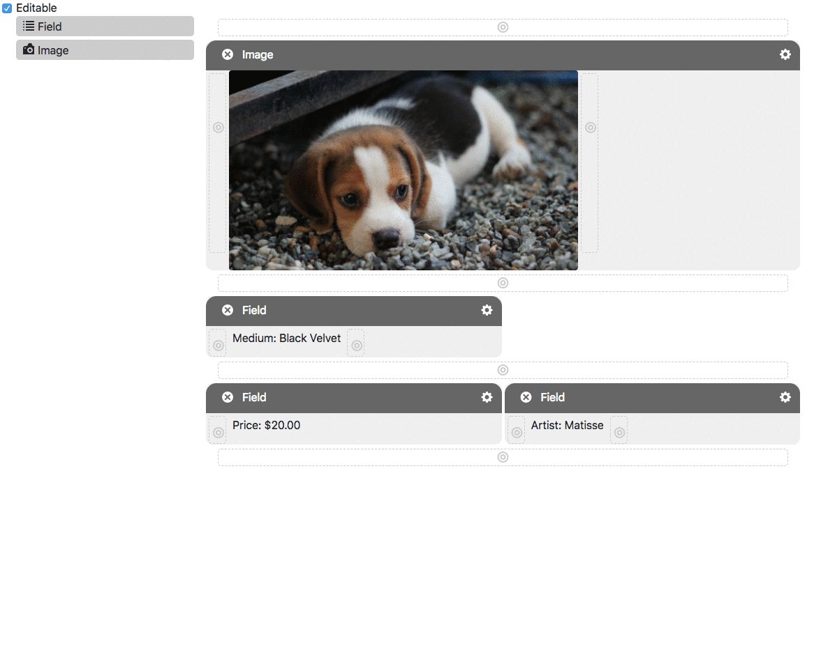

React-Ido 
=========

This project is the start of an OSS library for doing page layouts in fairly simplistic manner. You provide the system with a set of components from which the user may choose (`config`), and the initial state of the page (`elements`) and the editing system can be used to edit the layout. Another static rendering system renders the layout without the editing options.

